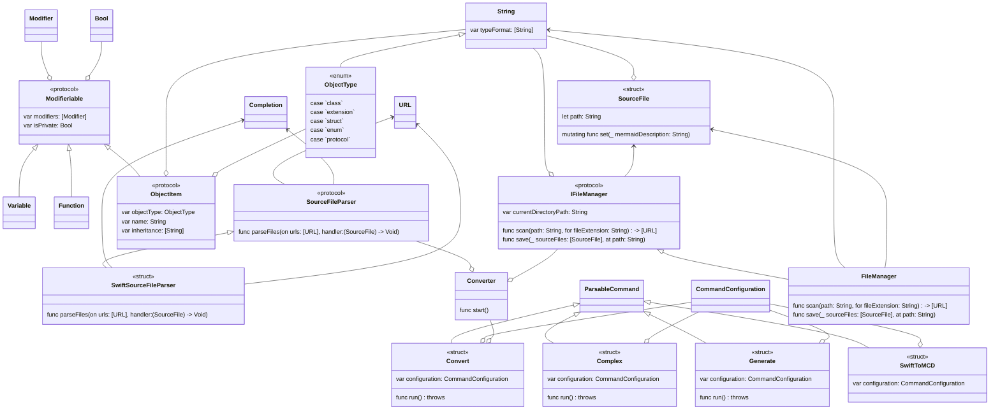

# swift-to-mcd
CLI инструмент для построения диаграмм классов из исходного кода на Swift

## Информация для пользователей
- Скомпилированный инструмент доступен в [Releases]
- Для работы требуется установка [mermaid-cli], также Вы можете сгенерировать схему из содержимого *result.mcd* онлайн на [Mermaid live]

## Пример сгенерированной диаграммы по данному проекту

## Информация по запуску проекта для разработки
- Склонируйте репозиторий и запустите [init.sh]
`./init.sh`

## Author
Timur Begishev\
telegram: [@t1murec]

## License
[Apache License 2.0]

[Releases]: <https://github.com/TimuREC/swift-to-mcd/releases>
[Mermaid live]: <https://mermaid.live/>
[init.sh]: <https://github.com/TimuREC/swift-to-mcd/blob/main/init.sh>
[mermaid-cli]: <https://github.com/mermaid-js/mermaid-cli>
[@t1murec]: <https://t.me/t1murec>
[Apache License 2.0]: <https://github.com/TimuREC/swift-to-mcd/blob/main/LICENSE>
