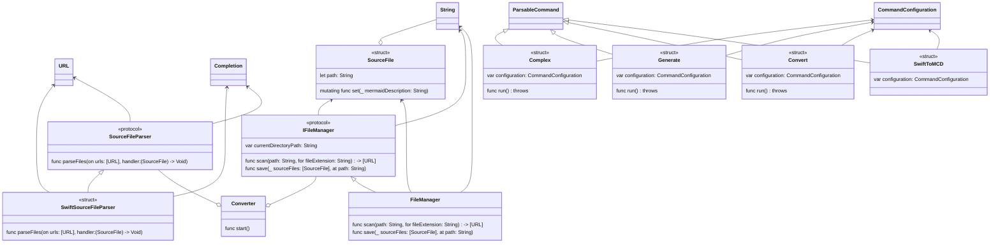

# swift-to-mcd
CLI инструмент для построения диаграмм классов из исходного кода на Swift

## Информация по запуску проекта
- Склонируйте репозиторий и запустите [init.sh]
- Для работы требуется установка [mermaid-cli]

## Пример сгенерированной диаграммы по данному проекту

## Author
Timur Begishev\
telegram: [@t1murec]

## License
[Apache License 2.0]

[init.sh]: <https://github.com/TimuREC/swift-to-mcd/blob/main/init.sh>
[mermaid-cli]: <https://github.com/mermaid-js/mermaid-cli>
[@t1murec]: <https://t.me/t1murec>
[Apache License 2.0]: <https://github.com/TimuREC/swift-to-mcd/blob/main/LICENSE>
